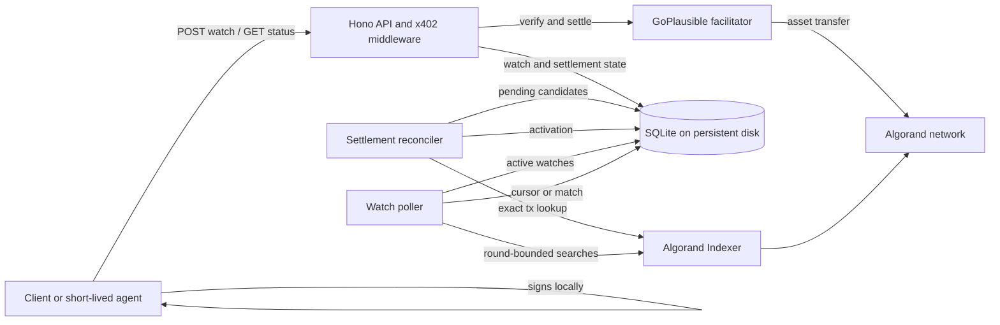
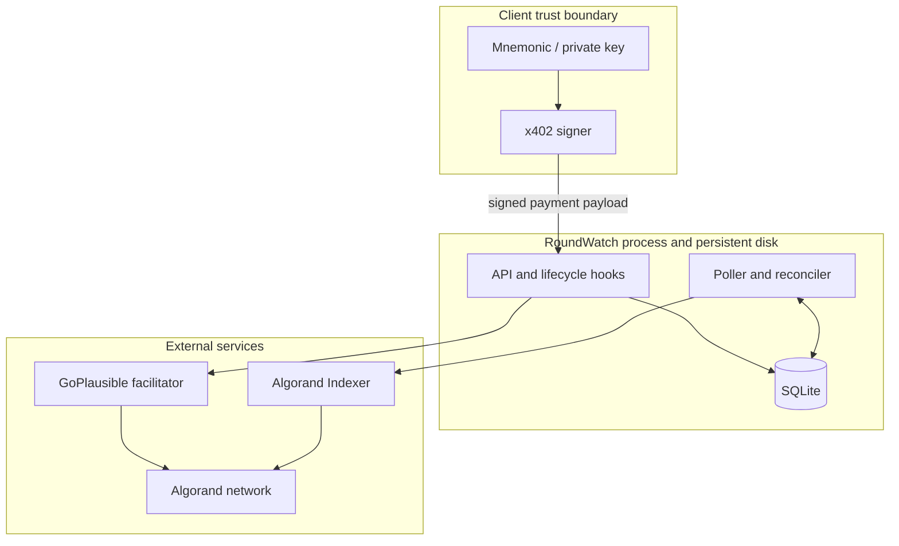
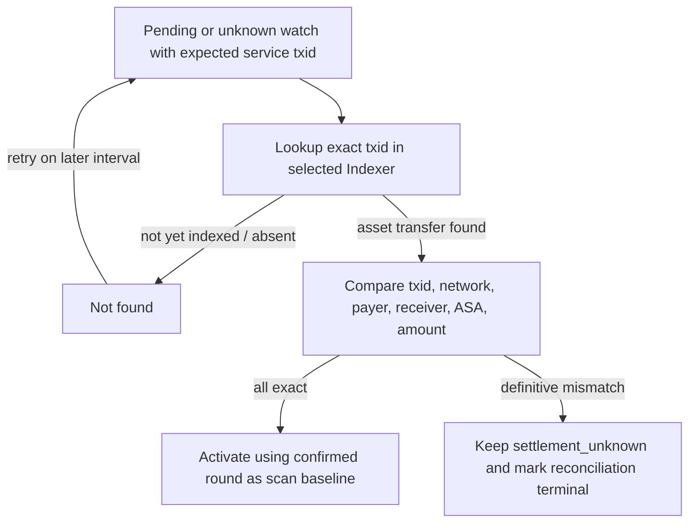

# RoundWatch architecture

RoundWatch is a paid resource server plus two durable background loops: one reconciles service-payment settlement, and the other looks for a future invoice payment. The current implementation is a single Node.js process backed by a local SQLite database on persistent storage.

## System context



## Components

| Component | Responsibility |
| --- | --- |
| Hono API | Exposes health, paid watch creation, and free watch-status retrieval. The MainNet watch route is `/v1/watch`; TestNet uses `/spike/watch`. |
| x402 resource server and middleware | Advertises exact AVM payment requirements, delegates verification/settlement to the facilitator, and invokes settlement lifecycle hooks. |
| GoPlausible facilitator | Verifies the client's signed x402 payment and submits the Algorand USDC service transfer. It also consumes the Bazaar discovery extension. |
| `RoundWatchStore` | Persists the watch specification, deterministic settlement identity, settlement evidence, activation cursor, and match result in SQLite. |
| `SettlementReconciler` | Recovers watches whose settlement succeeded or may have succeeded without a completed activation commit. |
| `RoundWatchPoller` | Scans bounded Algorand round ranges for exact future invoice transfers and advances each successful watch cursor. |
| `AlgorandIndexerClient` | Reads the current Indexer round, looks up a service-payment transaction by ID, and searches USDC asset transfers by sender and round range. |
| Client | Chooses the expected invoice properties, handles HTTP 402, verifies requirements as appropriate, signs locally, retains the watch ID, and later reads status. |

The application starts the reconciler and poller only after the HTTP server is listening. SIGINT and SIGTERM close the server, stop both workers, and close SQLite.

## Trust boundaries



- The mnemonic/private key remains in the client boundary. RoundWatch receives a signed payment payload and never needs wallet secrets.
- The service trusts the configured facilitator for x402 verification/settlement responses, but recovery activation also requires exact on-chain evidence from the configured Indexer.
- The service trusts the configured Algorand Indexer as its view of confirmed rounds and transactions.
- SQLite and its WAL files are operationally trusted durable state. Loss or rollback of that volume can lose or rewind obligations.
- Watch status has no authentication layer. A watch ID is a lookup identifier, not an access-control credential suitable for sensitive metadata.

## Purchase lifecycle

The installed x402/Hono lifecycle runs the application handler after payment verification but before final settlement. Handler execution alone is therefore not settlement evidence.

```mermaid
sequenceDiagram
    participant C as Client
    participant X as x402/Hono
    participant H as Watch handler
    participant D as SQLite
    participant F as Facilitator
    participant I as Indexer

    C->>X: POST watch without payment
    X-->>C: 402 payment requirements
    C->>C: Validate requirements and sign locally
    C->>X: Retry with PAYMENT-SIGNATURE
    X->>F: Verify payment authorization
    X->>H: Run verified request
    H->>H: Validate watch body and decode AVM payment identity
    H->>D: Insert settlement_pending watch + expected tx/network/payer
    H-->>X: Candidate 200 + internal watch ID header
    X->>F: Settle service payment
    F-->>X: Settlement evidence
    X->>D: Record settlement candidate
    X->>I: Read current confirmed round
    I-->>X: Activation round
    X->>D: Mark active; store settlement and scan baseline
    X-->>C: 200 watchId
```

The post-middleware response guard reloads the watch. If it is not `active` or already `matched`, the server replaces the candidate success with HTTP `500`. Thus a returned `watchId` means the durable activation completed; it is not merely proof that the handler ran.

## Settlement crash and reconciliation lifecycle

Before the settlement call, MainNet requires the handler to derive the deterministic Algorand payment transaction ID and payer from the verified AVM transaction bytes. It persists these with the watch in `settlement_pending`.

Normal settlement records the facilitator evidence and asks the Indexer for the current round. If that round lookup fails, the watch is not activated without a cursor. The persisted transaction identity leaves it recoverable.

When settlement reports a failure whose on-chain outcome is not definitive, the watch moves to `settlement_unknown`. Both non-terminal `settlement_pending` and `settlement_unknown` rows with an expected transaction ID are reconciliation candidates.



An ambiguous absence remains retryable. A found transaction with a definitive field mismatch fails closed and is no longer retried, although its public state remains `settlement_unknown`. The reconciliation path was fault-injection tested on TestNet before the MainNet launch.

## Future-payment matching lifecycle

Each poll tick loads all `active` watches and obtains a current confirmed Indexer round. For each watch:

1. refuse to scan if `scanAfterRound` is missing;
2. query the configured USDC asset from `scanAfterRound + 1` through the current round, filtered by expected sender;
3. compare the receiver, ASA, integer amount, and optional decoded UTF-8 note exactly;
4. store `matchedTransaction`, `matchedRound`, and state `matched` on the first exact match; otherwise advance `scanAfterRound` to the current round.

Failures are caught per watch. A failed lookup neither advances that watch's cursor nor prevents later watches in the same tick from being processed. This isolation is correctness hardening, not a claim of unlimited throughput.

## Persistence model

SQLite uses WAL mode and a single `roundwatch_watches` table. The durable record contains:

- UUID watch ID and unique idempotency key;
- public state: `settlement_pending`, `active`, `matched`, or `settlement_unknown`;
- expected invoice sender, receiver, server-selected asset ID, atomic amount, and optional note;
- expected service transaction, network, and payer derived before settlement;
- confirmed service transaction, network, payer, activation round, and activation time;
- scan cursor and creation time;
- matched invoice transaction and confirmed round; and
- an internal terminal-reconciliation flag used to distinguish a definitive mismatch from a retryable unknown outcome.

The public API omits the idempotency key but otherwise exposes the mapped watch record. Schema compatibility for newer settlement columns is handled at startup with guarded `ALTER TABLE` additions. There is no distributed migration service or external database.

## Idempotency

`idempotency_key` is unique. The handler checks it before inserting a watch. A repeated key returns HTTP `409` with the existing public watch record, causing x402 settlement not to proceed for that handler response. Callers must generate a distinct key per intended obligation and treat the returned existing record as authoritative; the service does not merge or replace the specification attached to an existing key.

## Deployment assumptions

The current production shape is one Render application instance with:

- the API, poller, and reconciler in one process;
- one local SQLite database;
- SQLite, WAL, and shared-memory files on the same `/data` persistent disk; and
- HTTPS terminated by the hosting platform.

The implementation has no leader election, distributed lock, shared queue, or multi-instance coordination. Horizontal replicas sharing or copying this state are outside the current design. Watch lifetime, active-watch capacity, quotas, and SLA are not yet defined.

## TestNet and MainNet separation

Network selection is explicit in `network-config.ts`; it is never inferred from a hostname. Omission safely defaults local development to TestNet, while production must opt in with `ROUNDWATCH_NETWORK=mainnet`.

| Property | TestNet | MainNet |
| --- | --- | --- |
| Watch route | `/spike/watch` | `/v1/watch` |
| USDC ASA | `10458941` | `31566704` |
| Default Indexer | `https://testnet-idx.algonode.cloud` | `https://mainnet-idx.algonode.cloud` |
| Discovery tag | `roundwatch-spike-0` | `x402-global-challenge` |
| Settlement identity required | Optional compatibility behavior | Required before watch preparation |
| Database | Relative local path allowed | Explicit absolute path required |
| URLs | Local development allowed | Facilitator, Indexer, and public base URL must use HTTPS; public base must not be loopback |
| Fault-injection exit | Available when explicitly enabled | Rejected at startup |

Both networks use facilitator-compatible full genesis-hash CAIP-2 identifiers rather than shortened SDK identifiers.
