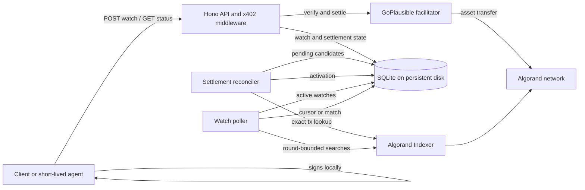
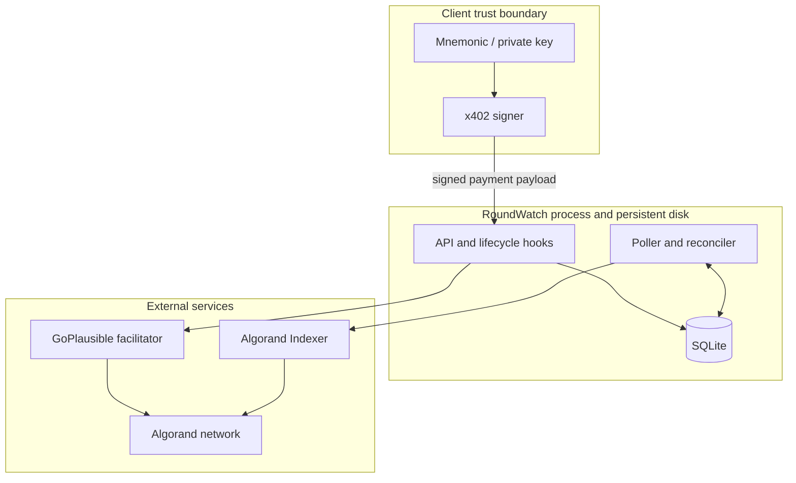
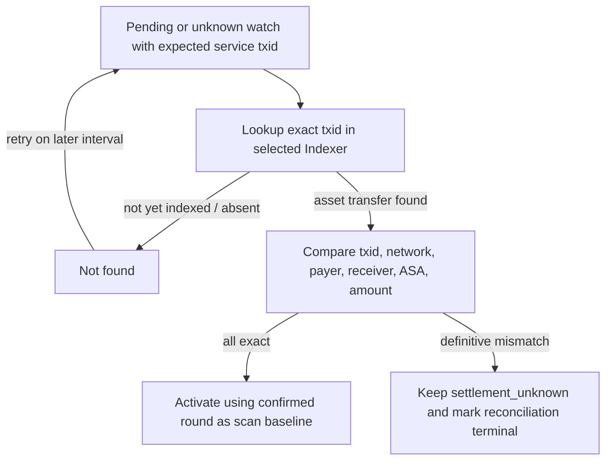

# RoundWatch architecture

RoundWatch is a paid resource server plus two durable background loops: one reconciles service-payment settlement, and the other looks for a future invoice payment. The current implementation is a single Node.js process backed by a local SQLite database on persistent storage.

## System context



## Components

| Component | Responsibility |
| --- | --- |
| Hono API | Exposes health, paid watch creation, and free watch-status retrieval. The MainNet watch route is `/v1/watch`; TestNet uses `/spike/watch`. |
| x402 resource server and middleware | Advertises exact AVM payment requirements, delegates verification/settlement to the facilitator, and invokes settlement lifecycle hooks. |
| GoPlausible facilitator | Verifies the client's signed x402 payment and submits the Algorand USDC service transfer. It also consumes the Bazaar discovery extension. |
| `RoundWatchStore` | Persists the watch, immutable purchase terms, proof metadata, conditional coverage cursor, and result in SQLite. |
| `SettlementReconciler` | Recovers watches whose settlement succeeded or may have succeeded without a completed activation commit. |
| `RoundWatchPoller` | Scans bounded Algorand round ranges for exact future invoice transfers and advances each successful watch cursor. |
| `AlgorandIndexerClient` | Performs validated page-level transaction, block, health, and exact-transaction requests through the shared dispatcher. |
| `IndexerRequestDispatcher` | Applies one finite token-bucket rate, burst, FIFO queue, and aggregate concurrency bound to every Indexer request attempt. |
| Client | Chooses the expected invoice properties, handles HTTP 402, verifies requirements as appropriate, signs locally, retains the watch ID, and later reads status. |

The application starts the reconciler and poller only after the HTTP server is listening. SIGINT and SIGTERM close the server, stop both workers, and close SQLite.

## Trust boundaries



- The mnemonic/private key remains in the client boundary. RoundWatch receives a signed payment payload and never needs wallet secrets.
- The service trusts the configured facilitator for x402 verification/settlement responses, but recovery activation also requires exact on-chain evidence from the configured Indexer.
- The service trusts the configured Algorand Indexer as its view of confirmed rounds and transactions.
- SQLite and its WAL files are operationally trusted durable state. Loss or rollback of that volume can lose or rewind obligations.
- Watch status has no authentication layer. A watch ID is a lookup identifier, not an access-control credential suitable for sensitive metadata.

## Purchase lifecycle

The installed x402/Hono lifecycle runs the application handler after payment verification but before final settlement. Handler execution alone is therefore not settlement evidence.

```mermaid
sequenceDiagram
    participant C as Client
    participant X as x402/Hono
    participant H as Watch handler
    participant D as SQLite
    participant F as Facilitator
    participant I as Indexer

    C->>X: POST watch without payment
    X-->>C: 402 payment requirements
    C->>C: Validate requirements and sign locally
    C->>X: Retry with PAYMENT-SIGNATURE
    X->>F: Verify payment authorization
    X->>H: Run verified request
    H->>H: Validate watch body and decode AVM payment identity
    H->>D: Insert settlement_pending watch + expected tx/network/payer
    H-->>X: Candidate 200 + internal watch ID header
    X->>F: Settle service payment
    F-->>X: Settlement evidence
    X->>D: Record settlement candidate
    X->>I: Read current confirmed round
    I-->>X: Activation round
    X->>D: Mark active; store settlement and scan baseline
    X-->>C: 200 watchId
```

The post-middleware response guard reloads the watch. If it is not `active` or already `matched`, the server replaces the candidate success with HTTP `500`. Thus a returned `watchId` means the durable activation completed; it is not merely proof that the handler ran.

## Settlement crash and reconciliation lifecycle

Before the settlement call, MainNet requires the handler to derive the deterministic Algorand payment transaction ID and payer from the verified AVM transaction bytes. It persists these with the watch in `settlement_pending`.

Normal settlement records facilitator evidence and looks up that exact transaction. Its confirmed round, rather than an Indexer health tip, becomes the activation round and initial cursor. A temporary failure leaves the paid durable obligation recoverable.

When settlement reports a failure whose on-chain outcome is not definitive, the watch moves to `settlement_unknown`. Both non-terminal `settlement_pending` and `settlement_unknown` rows with an expected transaction ID are reconciliation candidates.



A lookup 404 or ordinary failure remains retryable with persisted capped exponential backoff. Once the Indexer is beyond the signed `LastValid`, a complete txid search with an adequate response watermark may prove historical absence and terminal nonpayment. A confirmed transaction with incompatible immutable terms fails closed; both terminal outcomes remain public `settlement_unknown`.

## Future-payment matching lifecycle

Each poll sweep snapshots the `active` watches, rotates the starting position, and gives every watch at most one bounded servicing turn:

1. after the deadline, look up an indexed block whose timestamp is at or after it and persist that fixed `closingRound`;
2. choose a finite window from `scanAfterRound + 1`, clipped by the current Indexer tip and `closingRound`;
3. validate and consume one page, retaining only the opaque continuation token in memory;
4. advance the cursor conditionally only after every page proves the complete window and each page's `current-round` covers its requested upper bound; or
5. record an exact eligible match without claiming intervening coverage; and
6. transition to `expired` only after complete coverage reaches the fixed closing checkpoint with no eligible match.

Indexer transaction eligibility uses `confirmedRound > activationRound` plus exact sender, receiver, ASA, atomic amount, optional note, and `roundTime * 1000 < expiresAt`. The deadline is exclusive. Restart during pagination discards the token and safely replays that finite window.

The response contracts used here are the official Algorand Indexer [transaction search](https://dev.algorand.co/reference/rest-api/indexer/operations/searchfortransactions/), [exact transaction lookup](https://dev.algorand.co/reference/rest-api/indexer/operations/lookuptransaction/), and [block lookup](https://dev.algorand.co/reference/rest-api/indexer/operations/lookupblock/) APIs. In particular, a short page is not treated as complete when a continuation token exists.

Failures are isolated per servicing turn. A busy pagination session yields after one page so later watches still progress in the same sweep. The rotating sweep order and dispatcher's FIFO queue give continuously eligible scan and recovery work eventual service without allowing timer delay to accumulate an unbounded catch-up burst.

## Persistence model

SQLite uses WAL mode and a single `roundwatch_watches` table. The durable record contains:

- UUID watch ID and unique idempotency key;
- public state: `settlement_pending`, `active`, `matched`, `settlement_unknown`, or `expired`;
- expected invoice sender, receiver, server-selected asset ID, atomic amount, and optional note;
- expected service transaction, network, and payer derived before settlement;
- confirmed service transaction, network, payer, activation round, and activation time;
- scan cursor and creation time;
- persisted server-controlled expiry time for bounded watches;
- matched invoice transaction and confirmed round; and
- immutable signed service-payment receiver, ASA, amount, payer, `FirstValid`, and `LastValid`;
- reconciliation attempts and next-attempt timestamp;
- a fixed nullable closing checkpoint and evidence-version marker; and
- an internal terminal-reconciliation flag used to distinguish a definitive mismatch/nonpayment proof from a retryable unknown outcome.

The public API omits the idempotency key and internal proof, purchase-term, checkpoint, and retry metadata. Schema compatibility is handled at startup with guarded `ALTER TABLE` additions. There is no distributed migration service or external database.

## Idempotency

`idempotency_key` is unique. The handler checks it before inserting a watch. A repeated key returns HTTP `409` with the existing public watch record, causing x402 settlement not to proceed for that handler response. Callers must generate a distinct key per intended obligation and treat the returned existing record as authoritative; the service does not merge or replace the specification attached to an existing key.

## Expiry and admission capacity

The challenge-release contract gives each new watch a server-controlled deadline of `createdAt + 30 minutes`. Settlement latency consumes this interval. Wall-clock passage is not a lifecycle proof and reads never mutate the state. `expired` means the service baseline exists and the complete eligible range was validated through the fixed closing checkpoint with no match.

An open obligation is `settlement_pending`, `active`, or non-terminal `settlement_unknown`. Admission is capped at 50 open obligations globally and 5 for the deterministic service payer derived from the verified AVM payment payload. The store opens an immediate SQLite transaction, checks the idempotency key and both caps, and inserts the pending row without an asynchronous gap. Capacity failure returns HTTP `429` before after-handler settlement.

Schema additions are idempotent. Pre-hardening rows retain evidence version 0; missing validity terms, closing proof, deadlines, or historical coverage are never fabricated. Existing matched results remain unchanged, while ambiguous legacy rows stay conservative rather than being silently expired or declared unpaid.

## Deployment assumptions

The current production shape is one Render application instance with:

- the API, poller, and reconciler in one process;
- one local SQLite database;
- SQLite, WAL, and shared-memory files on the same `/data` persistent disk; and
- HTTPS terminated by the hosting platform.

The implementation has no leader election, distributed lock, shared queue, or multi-instance coordination. Horizontal replicas sharing or copying this state are outside the current design. The 30-minute lifetime and 50-global/5-per-payer caps are challenge-release safety bounds, not an SLA or a long-term commercial capacity commitment.

## TestNet and MainNet separation

Network selection is explicit in `network-config.ts`; it is never inferred from a hostname. Omission safely defaults local development to TestNet, while production must opt in with `ROUNDWATCH_NETWORK=mainnet`.

| Property | TestNet | MainNet |
| --- | --- | --- |
| Watch route | `/spike/watch` | `/v1/watch` |
| USDC ASA | `10458941` | `31566704` |
| Default Indexer | `https://testnet-idx.algonode.cloud` | `https://mainnet-idx.algonode.cloud` |
| Discovery tag | `roundwatch-spike-0` | `x402-global-challenge` |
| Settlement identity required | Optional compatibility behavior | Required before watch preparation |
| Database | Relative local path allowed | Explicit absolute path required |
| URLs | Local development allowed | Facilitator, Indexer, and public base URL must use HTTPS; public base must not be loopback |
| Fault-injection exit | Available when explicitly enabled | Rejected at startup |

Both networks use facilitator-compatible full genesis-hash CAIP-2 identifiers rather than shortened SDK identifiers.
